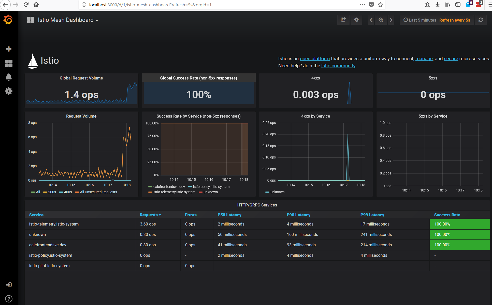

# Service mesh with Istio
> In this challenge you will install a service mesh in your Azure AKS cluster. Why would I want such a mesh? There are many reasons but most important is the fact that you can add some complicated routing and loadbalancing scenarios that you couldn't achieve otherwise. 
> - Have you ever thought about how to use fault injection to strengthen your system? With Istio you just configure it and challenge your services. 
> - What about testing in production? Sounds scary? Istio allows you to send a copy of the production traffic to your service instances deployed for testingbut the answer will be provided from the production services only. This allows you to analyze any issues before the actual service hits production. 
> - Ever thought about enabling https communication for a legacy application without changing the code? Istio can do that for you.

> There are of course much more use cases in which a service mesh could be of help. Get more details in their [documentation](https://istio.io/docs/). 

## Prerequisites
> Please use istio version >= 0.8.0 and Kubernetes >= 1.9.0

## Here's what you'll learn:
> - How to install Istio in your AKS cluster
> - How to configure ingress routes
> - How to gain insights about your applications routes
> - How to play with fault injection to challenge your services
> - Pitfalls

## How Istio works
This can only be a quick introduction but in general Istio consists of an control and a dataplane. The dataplane is basically where your data flows whereas the controlplane accepts your input in order to configure the dataplane. Usually a pod consists of one container if no special requirements are demanded, but for Istio there will be a sidecar container running in paralell to the actual container. This sidecar, which is an [envoy proxy](https://www.envoyproxy.io/) is responsible in handling all the network related stuff for the pod. More details can be found [here](https://istio.io/docs/concepts/what-is-istio/overview/).


## Install Istio

### Using Helm
There are several options to install istio. The simplest would be to just use helm to get everything up and running as described [here](https://istio.io/docs/setup/kubernetes/helm-install/).

### From scratch
See this [documentation](https://istio.io/docs/setup/kubernetes/quick-start/#download-and-prepare-for-the-installation) for instructions how to install istio using some install scripts. Please remember to [verify](https://istio.io/docs/setup/kubernetes/quick-start/#verifying-the-installation) your installation.

## Setup an ingress controller
It is a good idea to not expose each and every service individually but hide them behind an ingress controller. Istio provides one based on evoy. Besides the [documentation](https://istio.io/docs/tasks/traffic-management/ingress/) to setup the contnroller, can you expose your services through this ingress as well?

```yaml
apiVersion: networking.istio.io/v1alpha3
kind: Gateway
metadata:
  name: calcapps-dev-gateway
  namespace: dev          
spec:
  selector:
    istio: ingressgateway # use istio default controller
  servers:
  - port:
      number: 80
      name: http
      protocol: HTTP
    hosts:
    - "me.example.com"
---
apiVersion: networking.istio.io/v1alpha3
kind: VirtualService
metadata:
  name: calcapp-dev-vs
  namespace: dev  
spec:
  hosts:
  - "me.example.com"
  gateways:
  - calcapps-dev-gateway
  http:
  - match:
    - uri:
        prefix: /
    route:
    - destination:
        host: calcfrontendsvc
        port:
          number: 80     
```


> Hence: The easiest way to inject the sidecar to the pod is to use automatic sidecar injection. For that to work you must label your namespace to tell Istio to do the job.
> ```bash
> kubectl label namespace <namespace> istio-injection=enabled
> kubectl create -n <namespace> -f <your-app-spec>.yaml
> ```

If you applied the label after your pods were created, just destroy them and let the deployment spin up new instances. This time the pods will have one additional container running, namely the istio-proxy.

## Visualize your routes
In some cases it might be interesting to have a visual representation about the configured routes within the cluster. For that, you can use [servicegraph](https://istio.io/docs/tasks/telemetry/servicegraph/). Usually it is already installed when installing Istio. You can verify the installation using 

```bash
kubectl -n istio-system get svc servicegraph
NAME           CLUSTER-IP      EXTERNAL-IP   PORT(S)    AGE
servicegraph   10.59.253.165   <none>        8088/TCP   30s
```

In order to see the servicegraph in action you can forward the exposed ports to your local machine and connect accordingly.
```bash
kubectl -n istio-system port-forward $(kubectl -n istio-system get pod -l app=servicegraph -o jsonpath='{.items[0].metadata.name}') 8088:8088 &
```

You can get a glimse of your services when checking the [forcegraph](http://localhost:8088/force/forcegraph.html) 

There are more visual representations available. Details about them can be found [here](https://istio.io/docs/tasks/telemetry/servicegraph/#about-the-servicegraph-add-on)

## Monitor traffic
Another possibility to see whats happening within your mesh is to monitor the traffic. Therefore Istio provides Grafana dashboards. See if you can get some metrics about your system as described [within Istio's documentation](https://istio.io/docs/tasks/telemetry/using-istio-dashboard/).



## Fault injection
It might be interesting to see how your application behaves in cases where the surrounding services are no longer available or are failing intermittently. Therefore you can configure to inject failures into your routes. The chapter [fault injection](https://istio.io/docs/tasks/traffic-management/fault-injection/) describes how to apply it to your environment.

## Pitfalls
### Traffic to external services like Application Insights must be configured

Given that all traffic is routed through the envoy proxy, network requests that worked before might no longer be successful if the respective routes were not configured. If you have for instance ApplicationInsights active within your application, you need to generate a ServiceEntry object within your cluster, providing the information to allow traffic to the needed [endpoints](https://docs.microsoft.com/en-us/azure/application-insights/app-insights-ip-addresses).

> Hence: The ServiceEntries are bound to the namespace they live in. 

The following yaml shows how to enable those external services (Application Insights)

```yaml
apiVersion: networking.istio.io/v1alpha3
kind: ServiceEntry
metadata:
  name: vs-com
spec:
  hosts:
  - dc.services.visualstudio.com
  ports:
  - number: 443
    name: https
    protocol: HTTPS
```

```yaml
apiVersion: networking.istio.io/v1alpha3
kind: ServiceEntry
metadata:
  name: ms-com
spec:
  hosts:
  - dc.applicationinsights.microsoft.com
  ports:
  - number: 443
    name: https
    protocol: HTTPS
```

```yaml
apiVersion: networking.istio.io/v1alpha3
kind: ServiceEntry
metadata:
  name: rt-vs-com
spec:
  hosts:
  - rt.services.visualstudio.com
  ports:
  - number: 443
    name: https
    protocol: HTTPS 
```

```yaml
apiVersion: networking.istio.io/v1alpha3
kind: ServiceEntry
metadata:
  name: rt-ms-com
spec:
  hosts:
  - rt.applicationinsights.microsoft.com
  ports:
  - number: 443
    name: https
    protocol: HTTPS 
```